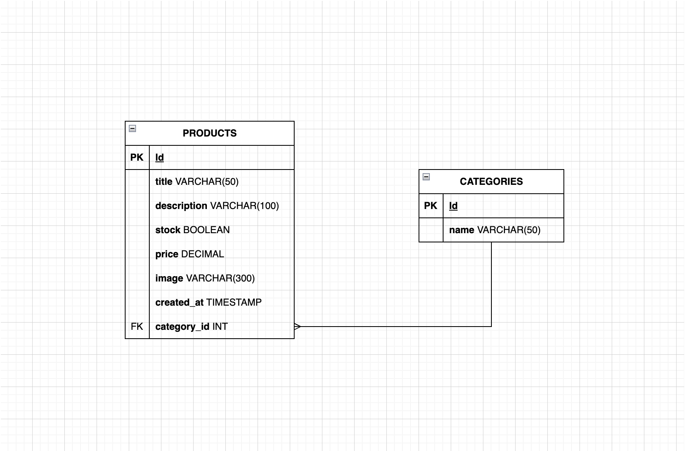

# Pokémon API 🧩

A RESTful API for a Pokémon-themed store – built with **Express**, **TypeScript**, and **MySQL**. This API allows you to manage products and categories using classic HTTP methods like `GET`, `POST`, `PATCH`, and `DELETE`.

---

## 🚀 Features

- Fetch all products
- Fetch a product by ID
- Create a new product
- Partially update a product (PATCH)
- Delete a product

- Fetch all categories
- Create a new category
- Get all products that belong to a specific category
- Update category
- Delete category

---

## 📦 Tech Stack

- **Backend:** Node.js + Express
- **Database:** MySQL (managed via phpMyAdmin)
- **Language:** TypeScript
- **Tools:** Insomnia / for testing

---


### 📥 Products

```http
GET     /products
GET     /products/:id
POST    /products
PATCH   /products/:id
DELETE  /products/:id
```

### 📥 Categories

```http
GET     /categories
POST    /categories
GET     /categories/:id/products
```

---

## 🧪 Example: Create New Product

```json
POST /products

{
  "title": "Lapras",
  "description": "A gentle Water-type Pokémon",
  "price": 189.99,
  "image": "assets/lapras.jpg",
  "stock": 1,
  "category_id": 2
}
```

---

## 📸 ER Diagram



---

## ✅ To Do

- [x] Full CRUD for products
- [x] Full CRUD for categories
- [x] Foreign key relation (products → categories)
- [ ] Frontend to consume the API

---

## 🧠 Developed by

Mikaela Kihl

---

